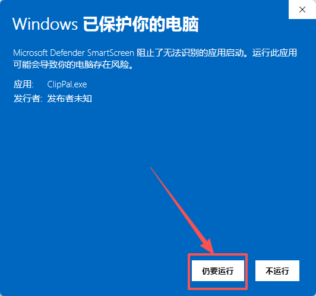

# Clip-Pal

Clip-Pal 是一个跨平台的剪贴板管理工具，支持文本、图片、文件等多种内容的自动收集、搜索、管理和快速粘贴。适用于开发者、办公人员等需要高效管理剪贴板内容的用户。

## 主要功能
- 自动监听剪贴板内容（文本、截图、图片、文件）
- 支持自动粘贴功能，双击卡片后自动粘贴到之前获得焦点的窗口
- 支持内容的模糊搜索
- 剪贴板历史记录管理、置顶、删除
- 支持多平台（Windows、macOS（敬请期待））
- 数据本地化存储，支持 粘贴内容数据加密存储
- 快捷键快速唤起和粘贴
- 支持内容去重、图片自动保存
- 支持多端同步、云同步

## 软件界面示例

主界面：


设置界面：


用户信息界面：


VIP界面


## 安装与运行

### 依赖环境
- Rust 1.60+
- Node.js 18+
- Vue3
- Cargo 或 npm
- SQLite3

### 本地实测环境(若出现编译问题请尝试使用实测环境)
- Node.js  -   v22.12.0
- Rust     -   rustc 1.87.0

### 安装步骤

1. 克隆项目：
   ```bash
   git clone https://gitee.com/ygz123/clip-pal.git
   cd clip-pal
   ```
2. 安装前端依赖：
   ```bash
   cd ./frontend
   npm install
   ```
3. 构建前端：
   ```bash
   npm run build
   ```
4. 回到项目根目录，运行桌面端：
   ```bash
   cd ..
   cargo tauri dev
   # 或 npm run tauri dev
   ```
5. 打包发布：
   - 这一步是生成你自己的软件更新公私钥，全局只需要执行一次，公钥你需要写到tauri.conf.json中，私钥你需要保存好，打包时需要配置到环境变量中(具体在下面有介绍)
   ```bash
   cargo tauri signer generate -w ~/.tauri/myapp.key
   ```
   - 下面这个是在软件版本更新时的打包流程：
   先打包前端:
   ```bash
   cd ./frontend
   npm run build
   cd ..
   ```
   设置更新密钥,win上是:
   ```bash  
   $env:TAURI_SIGNING_PRIVATE_KEY="自己的更新的私钥"
   $env:TAURI_SIGNING_PRIVATE_KEY_PASSWORD="私钥的密码(生成公私钥的时候输入的那个密码)"
   cargo tauri build
   ```
   mac上是:
   ```bash
   export TAURI_SIGNING_PRIVATE_KEY="自己的更新的私钥"
   export TAURI_SIGNING_PRIVATE_KEY_PASSWORD="私钥的密码(生成公私钥的时候输入的那个密码)"
   cargo tauri build
   ```

   - 如果你不需要版本更新功能，首先修改tauri.conf.json中的plugins.updater.active为false，然后：
   ```bash
   cd ./frontend
   npm run build
   cd ..
   cargo tauri build
   ```
6. 上传新包 和 更新latest.json
   ```
   windows下：
   打包后的新包会在target\release\bundle下，分别是msi和nsis，根据自身选择exe或者msi作为你的安装包。
   如果你需要自动更新功能，那么在target\release\bundle中的msi和nsis下有对应的exe.sig或者msi.sig签名文件，并且需要把exe.sig或者msi.sig文件中的内容更新到latest.json中的对应平台的signature字段中，然后上传/更新 你的latest.json文件
   ```


### 提示
- 如果你想自己开发自己打包，项目中的config.json你可以自己修改，建议使用"git update-index --skip-worktree src-tauri/config.json" 忽略掉对这个配置文件的修改，因为这个文件中配置了加密秘钥，自然不能公开
- 如果你之前忽略又想把它恢复回去那就执行："git update-index --no-skip-worktree src-tauri/config.json"
- 这个提示好像更多是告诉我自己的...

- 如果安装软件出现“Windows保护提示”，这是因为软件没有进行Windows安全机制认证(这个认证要几千块一年，所以没搞)；请放心安装，操作方式如下：

   
   

## 依赖
- [Tauri](https://tauri.app/)（桌面端框架）
- [rbatis](https://github.com/rbatis/rbatis)（Rust ORM）
- [serde/serde_json](https://serde.rs/)（序列化）
- [clipboard-rs](https://github.com/ChurchTao/clipboard-rs)（粘贴板监听）
- 其他详见 `Cargo.toml`

## 版本记录

| 版本号   | 日期         | 主要更新内容                                                                                             |
|----------|--------------|----------------------------------------------------------------------------------------------------|
| v1.0.0   | 2025-06-18   | 项目初始化，支持基础剪贴板监听与历史管理                                                                               |
| v1.0.1   | 2025-06-19   | 增加图片另存为功能，禁用页面鼠标右键，优化部分样式                                                                          |
| v1.0.2   | 2025-06-26   | 优化sqlite初始化逻辑，支持字段新增；添加数据加密存储功能(数据加密使用了分词功能，导致安装包体积增大了很多TvT)；增强日志打印；优化错误处理等等<br/>⚠️ 本次更新后需卸载并清除旧数据 |
| v1.0.3   | 2025-06-28   | 新增了自动粘贴功能；新增了新手引导；优化前端对内容卡片的展示样式；优化了部分代码                                                           |
| v1.0.4   | 2025-07-03   | 优化了前端代码，增加自适应UI，图片加载方式优化；去除了对内容的分词处理(安装包体积大大降低、内存占用率也大大降低)和.bin文件存储，采用内存搜索和bloomfilter配合的方式处理模糊搜索  |
| v1.0.5   | 2025-09-04   | 处理了很多bug；添加了云同步功能；添加了用户登录相关功能；添加了vip和支付相关功能  |
| v1.0.6   | 2025-10-31   | 添加软件更新功能  |
| v1.0.7   | 2025-11-27   | 适配macOS  |


## 开源协议

本项目基于 [Apache License 2.0](LICENSE) 开源。你可以自由使用、修改和分发本项目，但请保留原作者版权声明。

## ⚖️ 免责声明

1. 本项目是作为一款开源项目提供的，开发者在法律允许的范围内不对软件的功能性、安全性或适用性提供任何形式的明示或暗示的保证。
2. 用户明确理解并同意，使用本软件的风险完全由用户自己承担，软件以"现状"和"现有"基础提供。开发者不提供任何形式的担保，无论是明示还是暗示的，包括但不限于适销性、特定用途的适用性和非侵权的担保。
3. 在任何情况下，开发者或其供应商都不对任何直接的、间接的、偶然的、特殊的、惩罚性的或后果性的损害承担责任，包括但不限于使用本软件产生的利润损失、业务中断、个人信息泄露或其他商业损害或损失。
4. 所有在本项目上进行二次开发的用户，都需承诺将本软件用于合法目的，并自行负责遵守当地的法律和法规。
5. 开发者有权在任何时间修改软件的功能或特性，以及本免责声明的任何部分，并且这些修改可能会以软件更新的形式体现。

**本免责声明的最终解释权归开发者所有**

## 贡献方式

欢迎任何形式的贡献！你可以通过以下方式参与：
- 提交 Issue 反馈 bug 或建议
- Fork 并提交 Pull Request

## 联系方式

- 作者：jingchuan
- 邮箱：1750777402@qq.com
- QQ: 1750777402
- GitHub: https://github.com/1750777402/ClipPal
- Gitee: https://gitee.com/ygz123/clip-pal

---

> 本项目致力于为用户提供高效、安全的剪贴板管理体验。如果你喜欢本项目，欢迎 star、推荐和分享！ 